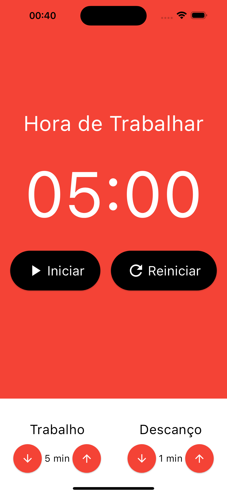
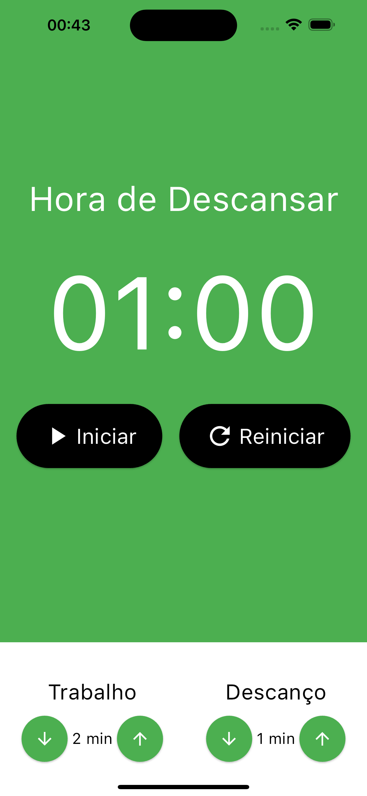
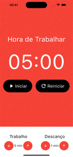
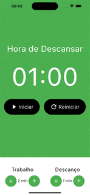

# Pomodoro
Este é um aplicativo de cronometro, com principal intuito de aprender MobX em flutter

### O que eu aprendi neste aplicativo
Neste aplicativo, aprendi conceitos de MobX, ...
 

### Layout

 

#### GIFS

 

## Como foi feito este projeto?

Este projeto foi totalmente feito a partir de um curso da udemy, na qual você pode [clicar aqui](https://www.udemy.com/course/curso-flutter/?couponCode=ST6MT42324) para acessar o curso 

Neste projeto contém estruturas de fundamentos de flutter, sendo elas:
- [X] MobX;
- [X] Cronômetro;

### Dependências
- ``Provider``
- ``mobx``
- ``flutter_mobx``
- ``build_runner``
- ``mobx_codegen``

### Tecnologias utilizadas
- ``VSCode``
- ``Dart``
- ``Flutter``
- ``XCode = Emulador de IOs``
- ``Android Studio = Emulador Android``
- ``iPad = Emulador iPadOS``

